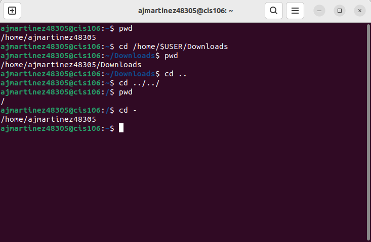
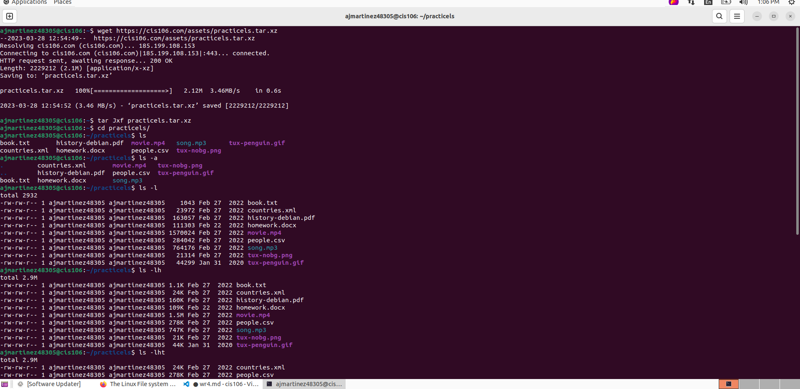
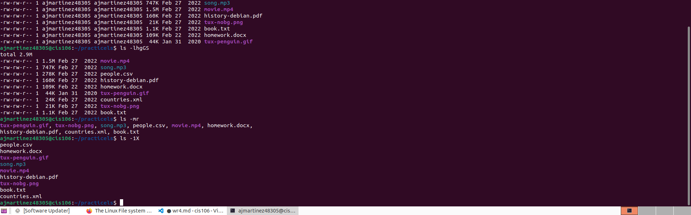
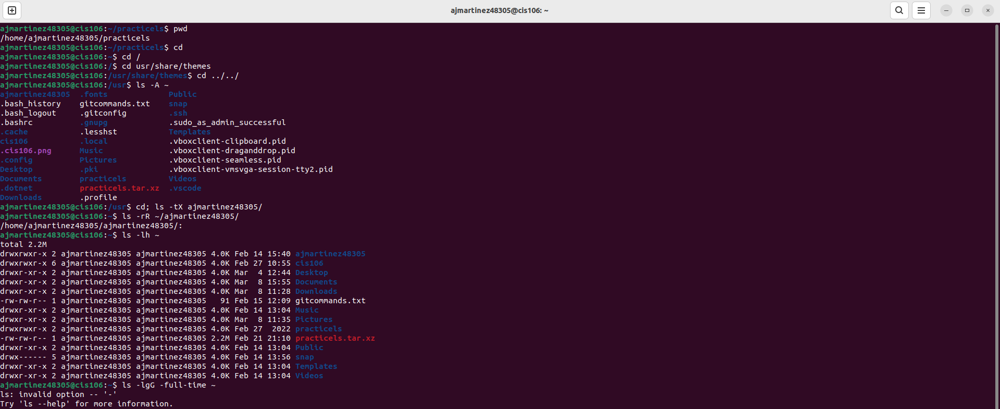
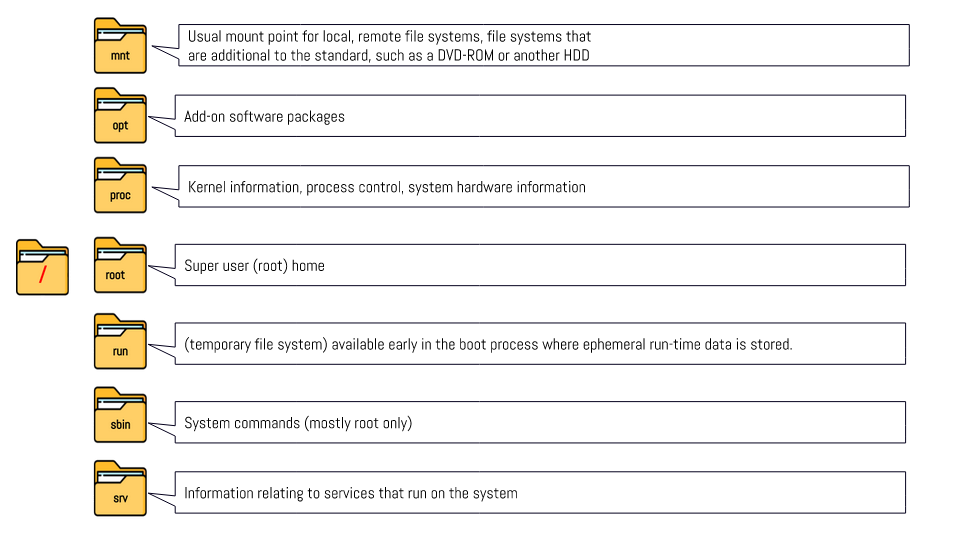

# Week Report 4

## Practice from the presentation The Linux File system
### Practice 1
 
### Practice 2
 
 
### Practice 3 
 

## The Linux File system directories and their purpose

 
 
 

## All the commands for navigating the filesystem

| Command | What it does                           | Syntax                          | Example        |
| ------- | -------------------------------------- | ------------------------------- | -------------- |
| pwd     | prints current directory               | pwd                             | 'pwd'          |
| cd      | changes the current working directory  | cd + destination                | 'cd Downloads' |
| ls      | lists the content of a given directory | ls + option + directory to list | 'ls'           |

## Basic Terminology

**File system:**  The way files are stored and organized.

**Current directory:** present working directory

**parent directory:** previous directory

**the difference between your home directory and the home directory:** *Your* home directory is the default directory when a user logs in. *The* home directory can be changed.

**pathname:** Indicates the location of the file in the filesystem.

**relative path:** The location of a file starting from the current working directory or a directory that is located inside the current working directory.

**absolute path:** The location of a file starting at the root of the file system.
