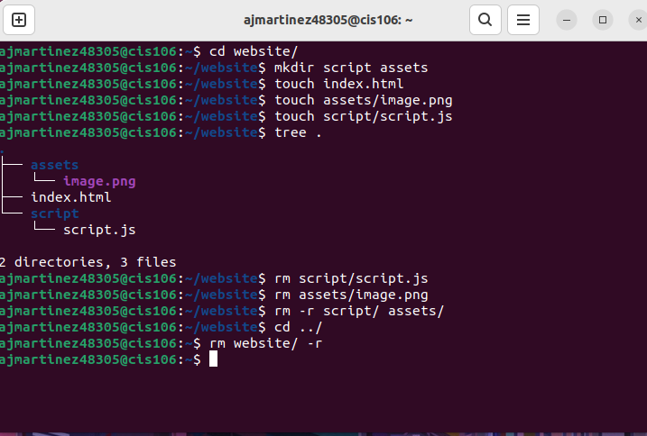
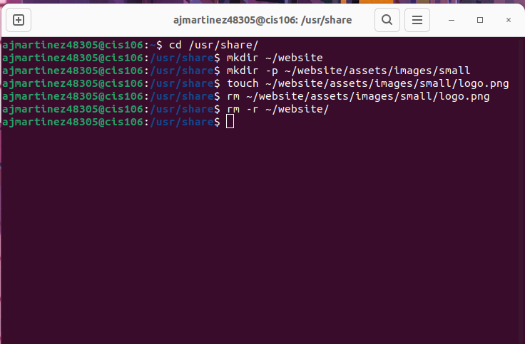
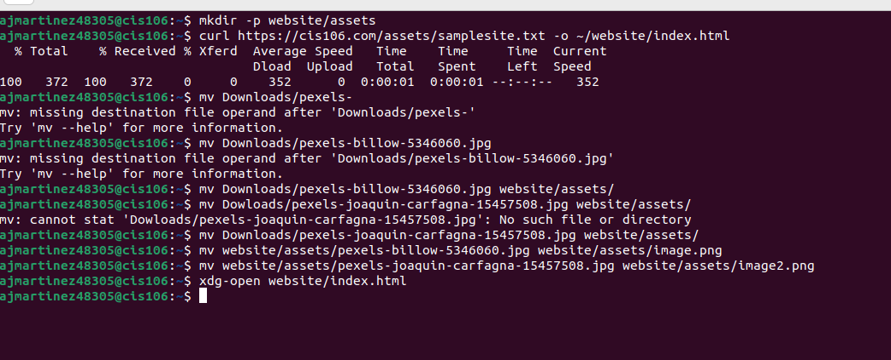
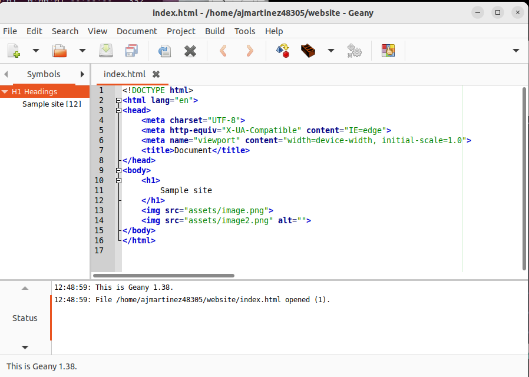
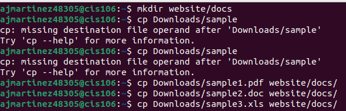
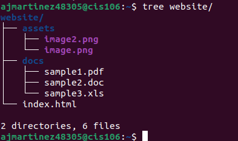

# Week Report 5

## Answers to questions:

* **What are Command Options?**
Command options modify/enhance the commands.
* **What are Command Arguments?**
Command arguments are the items open which the command acts on.
* **Which command is used for creating directories? Provide at least 3 examples.**
The command is mkdir.
* example 1:
  * Create a directory: 'mkdir potatoes'
* example 2:
  * Create multiple directories: 'mkdir movies ~/Downloads/games ~/Downloads/games
  * Create a directory with a space in the name: 'mkdir wallpapers/new\ cars
* **What does the touch command do? Provide at least 3 examples.**
The touch command is used for creating files.
* example 1:
  * Create a file called list: 'touch list'
* example 2:\
  * create several files: 'touch list_of_cars.txt script.py names.csv'
* example 3
  * Create a file using absolute path: 'touch ~/Downloads/games.txt
* **How do you remove a file? Provide an example.**
Use the rm command.
* example: 'rm list
* **How do you remove a directory and can you remove non-empty directories in Linux? Provide an example.**
To remove a directory use rm with the -r option. In Linux you cannot remove non empty directories.
* example: 'rm -r Downloads/games
* **Explain the mv and cp command. Provide at least 2 examples of each.**
The mv command moves and renames directories. The cp command copies files/directories from a source to a destination.
* Example 1:
  * To move a file from a directory to another using relative path: 'mv Downloads/homework.pdf Documents/
* Example 2:
  * To copy a file: 'cp Downloads/wallpaper.zip Pictures/
## Practice 1
 
## Practice 2
 
## Practice 3
 
 
## Practice 4
 
 