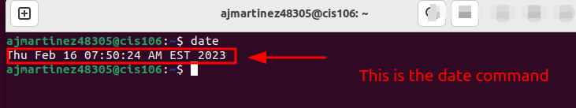

# Lab 3 Submission

## Question 1

## Question 2

Professor said to skip this question.

## Question 3

| Program purpose     | Package Name     | Version                            |
| ------------------- | ---------------- | ---------------------------------- |
| Play a tetris game  | blockattack      | 2.7.0-1                            |
| Play a video file   | dragonplayer     | 4:21.12.3-0ubuntu1                 |
| Browse the internet | epiphany-browser | 42.4-0ubuntu1                      |
| Read your email     | aerc             | 0.8.2-1ubuntu0.1                   |
| Play music          | clementine       | 1.4.0~rc1+git347-gfc4cb6fc7+dfsg-2 |

## Question 4

| command | what it does                                                   |
| ------- | -------------------------------------------------------------- |
| echo    | display a line of text                                         |
| fortune | print a random, hopefully interesting, adage                   |
| cowsay  | configurable speaking/thinking cow (and a bit more)            |
| lolcat  | rainbow coloring effect for text console display               |
| figlet  | display large characters made up of ordinary screen characters |
| toilet  | display large colorful characters                              |
| rig     | random identity generator                                      |
